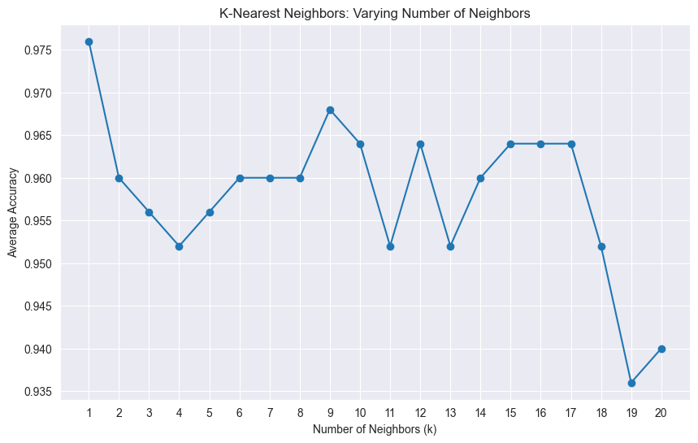

## Team:

#### Group 3


# Member Info:
#### - Kamron Hopkins
#### - hopkinsk19@students.ecu.edu

# K-Nearest Neighbors (KNN) Classifier with Iris Dataset

This project demonstrates how to implement a K-Nearest Neighbors (KNN) classifier using the scikit-learn library. It uses the Iris dataset to evaluate the accuracy of the KNN model for different values of \( k \) (from 1 to 20). The average accuracy is computed over multiple runs, and the results are visualized in a line chart.

## Prerequisites

- Python >= 3.5
- Libraries: numpy, matplotlib, scikit-learn

## Installation

1. Make sure you have Python installed. If not, download and install Python from [python.org](https://www.python.org/downloads/).

2. Install the required libraries if they are not already installed. You can install them using pip:

   ```bash
   pip install numpy matplotlib scikit-learn
   ```

## Usage

1. Clone or download this repository to your local machine.

2. Navigate to the directory containing the script.

3. Run the script:

   ```bash
   python knn_iris.py
   ```

   Make sure to replace `knn_iris.py` with the filename if you named it differently.

4. The script will:
   - Load the Iris dataset.
   - Iterate over \( k \) values from 1 to 20.
   - Split the data into training and test sets.
   - Train a KNN model and calculate its accuracy for each \( k \).
   - Print the average accuracy for each \( k \).
   - Plot a line chart showing the average accuracy for different values of \( k \).

## Code Explanation

- **Dataset**: The Iris dataset is loaded using `load_iris()` from scikit-learn.
- **Model**: The KNN model (`KNeighborsClassifier`) is trained and evaluated for different \( k \) values.
- **Cross-Validation**: For each \( k \), the model is evaluated five times with different train-test splits, and the average accuracy is computed.
- **Visualization**: A line chart is plotted to visualize the effect of different \( k \) values on the model's accuracy.

## Output

- The script prints the average accuracy for each \( k \) value from 1 to 20.
- A line chart is displayed showing the relationship between the number of neighbors (\( k \)) and the average accuracy of the model.

## Example Output

```
Average accuracy for k=1: 0.98
Average accuracy for k=2: 0.96
Average accuracy for k=3: 0.96
...
```

## Visual Output

A line chart similar to the one below will be displayed, showing the accuracy of the KNN model for each value of \( k \):


